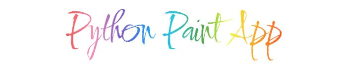

# Python Paint App
Paint App for hackathon challenge

* [Hackathon Instructions](#hackathon-instructions)
* [About Python Paint App](#about)
* [Features](#features)
* [Known Issues](#known-issues)
* [Tech Stack](#tech-stack)
* [Deploying](#deploying)
    * [Deploying on Local Server](#deploying-on-local-server)
    * [Deploying on Python Anywhere](#deploying-on-python-anywhere)
* [About the Developer](#about-the-developer)

## Demo:
[Live Demo](http://3.21.234.185)

> #### NOTE: There is no SSL certificate so "https://" will NOT work, you must make sure to use "http://" in front of the IP address.

## Hackathon Instructions
### Paint App - Becoming Bob Ross
Computers have been a boon for creativity and imagination. Digital art has, for decades now, been a medium in its own right; and with the advent of NFTs, the future might be very bright indeed for digital artists. Today, we'll build an app that lets your friends and loved ones express their creative side.

Today, your challenge is to build one of the below:

#### Frontend-only
Build an app that lets people express their creativity in a visual format. You can build ANY application you'd like. Whether it's a blank canvas that you can paint on, a photo-editing app, a shared white board -- as long as it fulfills one OR both of the following requirements:

- As a user, I can drag my mouse across the screen to make free-form lines.
- As a user, I can click areas of the screen with my mouse to fill them with a color, texture or pattern.
#### Full-stack (Optional)
Broadly speaking: add a full-stack feature that makes sense for your application. Examples include:

- Shareable art
- Saveable files
- User profiles with galleries of work
#### For teams with UX/UI Designers
A big welcome to our first cohort of UX/UI designers! Your teams are super fortunate to have the vision and finesse that a designer can bring! To make sure you get credit for your work, please include your designs in a shareable format (PDF, Adobe XD or a public Figma is recommended). The best place to include this is on the application's landing page AND on the Github repo's README file. It's recommended that you also share your work on LinkedIn and Twitter, since this counts towards storytelling for you personally.

<!-- #### Here are some achievable application inspirations on Codepen:
- [HTML5 Drawing Pad](https://codepen.io/HarryGateaux/pen/BApxl)
- [Drawing from Dots](https://codepen.io/cftflora/pen/xdAIw)
- [SVG Coloring Book](https://codepen.io/tigt/pen/xZEdoP)
#### Advanced applications, for further inspiration. We DO NOT recommend you build these...
- [Aggie.io](https://aggie.io/)
- [Free Coloring Pages](https://www.free-coloring-pages.com/online.html)
Best of luck, and make sure to consult the [Hiring Hackathon Guide](https://info.mintbean.io/hiring-hackathon-guide)! -->

## About
This is a simple Web painting application built using the Django framework and JavaScript to allow interaction with the canvas.

## Features
### Controls
- Simple Brush
- Eraser
- Pattern Stamp Tool
- Color Picker
- Brush Size Slider
- Clear Canvas Button

### Functionality
- Resize Brush/Eraser/Stamp
- Stores size for each tool
- Stores color for each tool
- User account creation
- Save canvas to account
- Account view
- View user saved art
- View recent activity
- Delete saved art
- Edit previously saved art

### Functionality to be Added
- Additional brush shapes
- Additional stamp shapes
- Line/Shape tool
- Fill tool
- Undo/Redo
- Load/Paste Image
- Save as Copy

## Known Issues
- See [Issues](https://github.com/GuardianBob/PaintApp/issues) for a list of known bugs.
```
NOT compatable with Internet Explorer
```

## Tech Stack
- Python 3.9
- Django 3.2.8
- Bootstrap CSS 5.0.2
- Bootstrap JS 5.0.2
- jQuery 3.5.1
- FontAwesome 5.15.1
- Google Webfonts
- Canvas API

## Deploying
There are several resources for deploying Django Apps.  One of the simplest platforms is Python Anywhere, which has a free tier.  I highly recommend this one because of how straightforward it is.  I've deployed on an AWS EC2 server for my own practice which is much more complicated and doesn't automatically set up SSL for you.
### Deploying on Local Server:
- Clone a copy of the project
- Using venv, create a virtual environment for the project
- Launch the virtual environment and use the "requirements.txt" to install all of the required dependancies including the version of Django this project was built on.
```
NOTE: From this point, all commands should be run while working in the virtual environment you created
```
- From the command prompt/terminal, making sure you are working in the virtual environment, navigate to the folder containing the project
- Create a file in the program folder, "paintApp", called ".env"
```
NOTE: This next step only works on Python 3.6 or higher:
```
- From the command prompt/terminal run:
    - `python -c "import secrets; print(secrets.token_urlsafe())"`
- This will generate a secret key for the project
- Copy the newly created secret key, open .env in a code/text editor and add the following line (quotes seem to be optional):
    - `SECRET_KEY='*your_secret_key_here*'`
- save and close the .env file
- Run the following commands to create and set up the database:
    - `python manage.py makemigrations`
    - `python manage.py migrate`
- Setting up an admin or superuser account is pretty straight forward in the documentation.  Refere to the following link for step-by-step
    - [https://docs.djangoproject.com/en/3.2/intro/tutorial02/#creating-an-admin-user](https://docs.djangoproject.com/en/3.2/intro/tutorial02/#creating-an-admin-user)
- You should now be ready to launch your local copy!
- Run the following command
    - python manage.py runserver

### Deploying on Python Anywhere:
Python Anywhere's instructions are very detailed and should be enough to help you get a copy up and running.
- [https://help.pythonanywhere.com/pages/DeployExistingDjangoProject/](https://help.pythonanywhere.com/pages/DeployExistingDjangoProject/)

## About the Developer
> [LinkedIn Profile](https://www.linkedin.com/in/meyerjg)

My name is Jesse Meyer and I am a full stack developer.  I've been dabbling in coding since highschool, back in the days of AOL, GeoCities, and AngelFire.  I spent a few years as a Graphic Designer and Web Developer, working mostly in WordPress for my web development.  Recently I decided to make the switch to software development and switch careers.  I completed the Python Full Stack course at Coding Dojo, earning a black belt from my final project which can be seen here:

- [Veterinary ER Hospital Shift Scheduler](https://github.com/GuardianBob/ShiftScheduler)

I built this app for a jr dev hackathon hiring event through [Mintbean](https://mintbean.io).  For more on how I created this app, the process I went through and the challenges I had to solve, please visit the demo's [landing page](http://3.21.234.185/)

Cheers!
